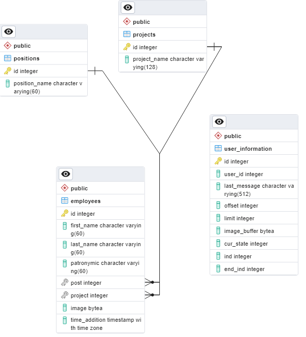

# Описание

Данный репозиторий содержит приложение, реализующее telegram bot для конкурса "Разработка бизнес-приложений"
Codemasters Code Cup.

## Архитектура

Приложение состоит из следующих сервисов:

* База данных (PostgreSQL) для хранения информации о пользователях
* Telegram bot непостредственно сам телеграм бот
* Server API - реализует функционал взаимодействия с БД

Общение с API осуществляется посредством REST запросов.


Все сервисы завернуты в Docker-контейнер

## База данных

Схема базы данных:


### Описание таблиц:

Таблица **Employees** используется для хранения информации о добавляемых сотрудниках

Таблица **Positions** связана с таблицей Employees и используется для хранения информации о должности сотрудников.
Данное решение обусловленно возможностями расширения базы данных путем добавления дополнительных полей.

Таблица **Project** связана с таблицей Employees и используется для хранения информации о проекте.
Была создана из тех же убеждений что и предыдущая.

# Установка

Конфигурирование приложения осуществляется с помощью `.env` файла. 
Переименуйте файл `.env_example` в `.env` и укажите следующие поля:

```commandline
TELEGRAM_TOKEN --- Telegram token вашего бота
PORT ---  Порт, на котором будет работать Server API
POSTGRES_USER --- Имя пользователя для подключения к PostgreSQL (по умолчания postgres)
POSTGRES_PASSWORD --- Пароль для подключения к PostgreSQL (по умолчания postgres)
POSTGRES_DB --- Название PostgreSQL (по умолчания postgres)
DATABASE_URI --- URL адрес для подключения к серверу PostgreSQL <IP>:6501 (IP в данном случае ваш локальный, можно посмотреть ipconfig в windows, ifconfig linux) 
SERVER_URI --- URL адрес Server API http://<IP>:8000 (IP в данном случае ваш локальный, можно посмотреть ipconfig в windows, ifconfig linux)
```

Далее для запуска необходимо выполнить команду:
```commandline
sh ./tools/run_server.sh
или
docker compose up --build
```

Для очистки данных docker контейнера необходимо выполнить команду:
```commandline
docker compose down --volumes
```

## Описание функционала

Для начала взаимодействия с ботом необходимо написать ему `/start`

**Так же для перезагрузки бота необходимо использовать команду `/start`**

Возможности:
* Бот может добавлять сотрудников в базу
* Корректировать информацию о сотруднике перед его добавлением в базу
* Корректировать информацию о уже добавленных сотрудниках
* Удалять сотрудников
* Производить поиск сотрудников по полям Имя, Фамилия, Отчество (Реализуется как полнотекстовый поиск так и по три-граммам)
* Производит валидацию вводимый параметров на их корректность и при необходимости перезапрашивает необходимую информацию

Рассмотрим взаимодействие с ботом и покажем функционал дабы не быть голословными.

После отправки боту команды `/start` он встречает нас приветственным сообщением и предлагает свою помощь


Добавим сотрудника. Для этого выберим соответствующий пункт и также заполним дополнительные поля, 
после этого бот предложит нам подтвердить введенную информацию


Вот незадача! Мы ошиблись когда заполняли **Должность** и написали туда отчество... Но кто не ошибается? Не беда, сейчас исправим!
Нажимаем кнопку **"Отредактировать ввод"** и выбираем нужный нам пункт


Бот предлагает нам ввести новую информацию, сделаем это. Посмотрим на результат:


Как видно все работает! :)

Ну и на последок рассмотрим меню удаления сотрудника... Он нам не надоел, просто для демонстрации :)


Данное меню предлагает ввести индекс сотрудника, если мы его знаем заранее или же найти его по ФИО. 
А если мы передумаем всегда можно выйти в главное меню

Это далеко не весь функционал, очень много осталось за кадром. 
Но вы всегда можете восполнить свое любопытство попробовав попользоватья этим ботом